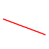
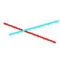
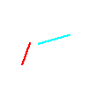
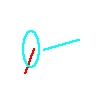
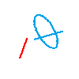
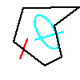
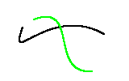
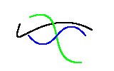

# Panel 使用说明书
## 开发环境
JetBrains PyCharm  
python版本 3.6.6
#### python包版本
（已提供requirements.txt）  
scipy==1.0.0  
numpy==1.17.2  
opencv_python==3.4.0.12  
PyOpenGL==3.1.0  
#### 使用方法
修改panel.py中的order_mod和out_mode可以改变输入和输出方式  
FILEIN 文件输入，会读取根目录下的input.txt文件逐行执行指令  
STDIN 控制台输入，根据控制台的input order提示输入指令并执行  
FILEOUT文件输出，log会输出到根目录下的log.log文件中  
STDOUT 控制台输出，log会输出到控制台  
PyCharm 导入项目并安装requirements.txt后运行panel.py即可，每单击一次画布会执行一条input.txt中或通过控制台输入的的指令  
若无PyCharm，根目录下通过pip install -r requirements.txt 安装环境，之后进入src文件夹使用python3 panel.py运行程序  
## 文件说明
graph.py 定义图元类，定义图元属性，实现各种图元处理算法  
interpreter.py 指令解释器，识别指令合法性，返回指令类型和指令参数  
panel.py 维护画布对象，负责处理指令解释器返回的Item，根据返回的指令类型和参数执行对应功能
## 指令说明
resetCanvas weight(int) height(int) 清空画布并重置画布宽高  
setColor r(int) g(int) b(int) 设置画笔颜色为r,g,b  
saveCanvas filename(str) 图像保存为filename文件  
drawLine id(int) x1(int) y1(int) x2(int) y2(int) algorithm(str) 画线，参数为图元id，起始点坐标，终点坐标，使用算法  
drawPolygon id(int) n(int) algorithm(str) 2n个(int)  画多边形，参数为id，顶点数，算法，顶点坐标对
drawEllipse id(int) x0(int) y0(int) xr(int) yr(int) 画椭圆，参数为id，圆心坐标，长短轴长  
drawCurve id(int) n(int) algorithm(str) 2n个(int)  画曲线，参数为id,控制点数，算法，控制点坐标对
translate id(int) dx(int) dy(int) 平移图元，参数为id，x，y方向上的平移量  
rotate id(int) x0(int) y0(int) theta(int) 旋转图元，参数为id，旋转中心，旋转角度（正为顺时针，负为逆时针）  
scale id(int) x0(int) y0(int) scale(float) 缩放图元，参数为id，缩放中心，缩放倍数    
clip id(int) x0(int) y0(int) x1(int) y1(int) algorithm(str) 剪裁线段，参数为id，剪裁框对角线上两个点的坐标对，算法  
## 运行结果展示
画线 DDA  
  
画线 Bresenham  
  
剪裁 红线Cohen-Sutherland 蓝线Liang-Barsky  
  
旋转红线  
  
画椭圆  
  
旋转并缩放椭圆  
  
画多边形  
  
旋转缩放平移多边形  
  
画曲线Bezier    
  
画曲线B-spline（蓝线）  
  